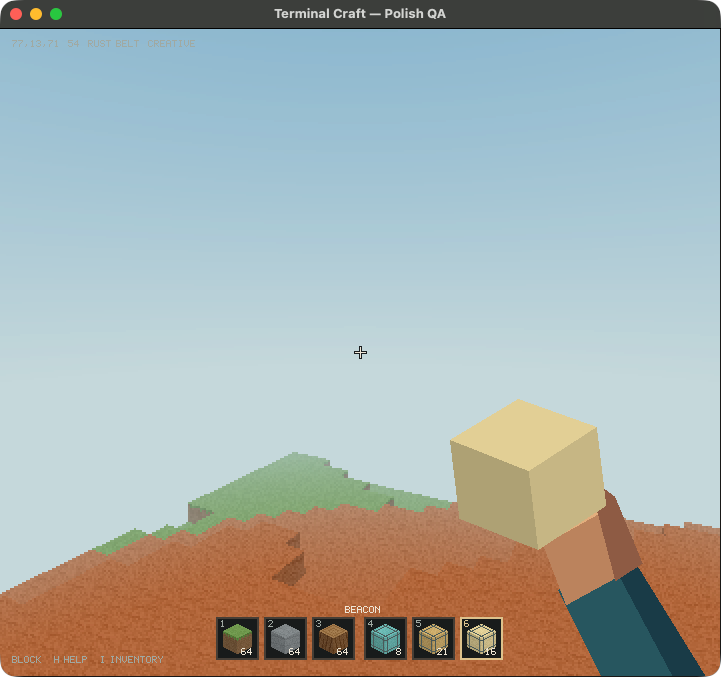
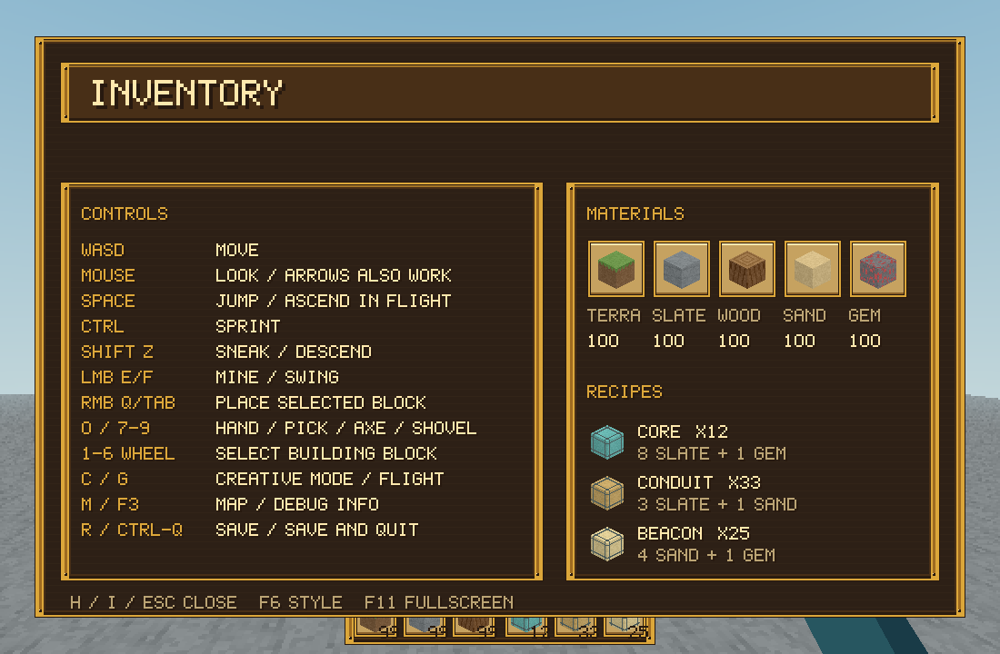

# Terminal Craft

A native Rust voxel sandbox. **The app now opens a native game window with real
pointer-locked mouse look.** Literal terminal rendering remains available as an
option. Both hosts share one game engine, renderer, repository and save format.
No browser, Node.js server, Chrome profile or relay is involved.

**Repository:** [janestreetshiller/terminal-craft](https://github.com/janestreetshiller/terminal-craft)



Public source repository maintained by **janestreetshiller**. The existing license
is **all rights reserved**, not an open-source license; publication does not change
those terms.

**App:** `/Applications/Terminal Craft.app`

**Command:** `terminal-craft` (`terminalcraft` and `termcraft` remain aliases).

The separate browser game is **Block Craft**, launched by `block-craft` or
`/Applications/Block Craft.app`. It is not bundled into this repository.

## Five prebuilt worlds — 0.10.0 source candidate

Choose **Prebuilt worlds** from the main menu: **Foundry**, **Switchyard**,
**Citadel**, **Skybridge**, or **Dune Outpost**. Each is an original, fixed arena
with its own editable/resumable save. Your normal world is not overwritten.
Templates are embedded for offline play; these are not downloaded community maps
or an MW2 Rust remake.

[Map details, save locations and verification limits](docs/prebuilt-worlds.md).
[Candidate status and remaining release gates](docs/prebuilt-repair-status.md).
Quick launch: `terminal-craft --map foundry`. Gilded remains the default UI.

## Gilded UI

Launch `terminal-craft` for Gilded, or press **F6** in the running game to switch
between Gilded and Classic. The default skin uses original
gold-and-bronze pixel frames, cream inventory slots, a resource/recipe field
guide, and matching menu, hotbar and map chrome. It changes no gameplay or saves.



[Mode selection, screenshots and verification](docs/gilded-ui.md). This is a
built-in visual mode, not an external mod loader or an imported texture pack.

## Motion in 0.9.0

- Native SDL window, relative mouse input and real pointer lock. Turning does not
  stop at a window edge; vertical aiming reaches nearly straight up/down.
- Simultaneous movement, looking, jumping and mining. Native keys stay held until
  release, without the old terminal timeout or keyboard-repeat delay.
- Walking, normalized diagonal movement, sprinting, slow/lowered-view sneaking,
  jumping, creative flight, ascent and descent. Flight respects solid ceilings.
- Escape pauses and releases the pointer. Losing focus clears held controls and
  pauses; regaining focus does not silently resume the game or grab the pointer.
- Mouse/keyboard main and pause menus, save-and-return-to-menu, controls/inventory,
  a native overhead map, resizable windows and F11 fullscreen.
- Kitty mode now negotiates press/repeat/release reporting. The verified input
  probe supersedes the old comment that CSI-u was unsupported.

This is keyboard/mouse navigation for a bounded sandbox, not a claim of gamepad,
VR, browser-feature parity or a complete Minecraft implementation. Mobs,
health/combat and multiplayer have not been ported. Sneaking lowers the viewpoint
and slows movement; it does not implement crawling or a smaller collision hull.

## Shared game features and rendering

- Seeded voxel terrain, trees and six language-themed regions.
- First-person arm/hand, held blocks, pickaxe, axe and shovel.
- Swing/equip animations, movement bob, held mining, material-specific tool speeds.
- Six building slots and resource-based CORE, CONDUIT and BEACON recipes.
- Resource/survival and creative modes; tools are available in both modes.
- Procedural voxel materials, consistent 70-degree render/interaction rays,
  target outlines, mining cracks, textured hotbar and debug/FPS display.
- Atomic saves with terrain, resources, selected tool/block, player pose and mode.
- Optional Kitty graphics transport and ANSI half-block fallback.

Gameplay targets a 60 FPS frame budget. Balanced quality bounds world rendering
cost while drawing the hand/HUD at the host's render resolution. The native host
uses logical window dimensions and nearest-neighbor presentation on HiDPI
screens. `TERMINAL_CRAFT_QUALITY=native` requests full-resolution world sampling.

See [native motion verification](docs/motion.md) and the historical
[0.8.1 polish report](docs/polish.md). CPU timings are not physical display FPS.

## Controls

| Input | Action |
|---|---|
| WASD | Move; diagonal speed is normalized |
| Mouse / arrows | Look; native mouse look uses relative motion |
| Space | Jump / ascend in flight |
| Ctrl | Sprint |
| Shift / Z | Sneak (slow, lowered view) / descend in flight |
| Hold left mouse / E / F | Mine or swing |
| Right mouse / Q / Tab | Place selected hotbar block |
| 0 | Empty hand |
| 7 / 8 / 9 | Pickaxe / axe / shovel |
| 1–6 | Select and hold block |
| Wheel / `[` / `]` | Cycle blocks |
| H / I | Controls, inventory and recipes; pauses gameplay |
| M | Overhead map; pauses gameplay |
| C | Toggle creative mode |
| G / double Space | Toggle flight in creative mode |
| F3 | Debug information |
| F6 | Switch Classic / Gilded UI for this session |
| F11 | Native fullscreen / windowed |
| R | Save |
| Esc | Close overlay; otherwise pause/resume and release/recapture pointer |
| Ctrl-Q / Ctrl-C | Save and quit |

The native pause menu offers **Resume**, **Save and main menu**, and **Save and
quit**. Use arrows/W/S and Enter, or click. Controls/map overlays also close on a
click. Returning from focus loss requires an explicit resume.

Terminal mode cannot provide native pointer lock or native-window fullscreen.
Kitty supports reliable key release; other terminals without it use the legacy
400 ms hold fallback. `TERMINAL_CRAFT_LEGACY_INPUT=1` opts out of enhanced key
reporting for diagnostics. Terminal pause uses the controls overlay.

## Build, test, install

Build requirements: Rust 1.88+ and Cargo, CMake, a C/C++ compiler, and macOS SDK
command-line tools. Python 3 is used for packaging and integration tests. SDL is
built and statically linked by Cargo; the installed native app needs **neither
Homebrew SDL nor Kitty**. Initial dependencies may download. The project-local
CMake policy setting keeps the vendored SDL build compatible with CMake 4.

```sh
git clone https://github.com/janestreetshiller/terminal-craft.git
cd terminal-craft
cargo test --locked
cargo fmt --check
cargo clippy --all-targets --locked -- -D warnings
python3 scripts/install_macos.py
python3 scripts/verify.py
```

The verifier builds and tests a source snapshot with separate offline Cargo
cache, build output and disposable saves. It never installs the app or rewrites
the shared `target` directory. It prints the evidence directory and binds results
to source and binary hashes. Required dependencies must already be cached.

Native and installed-app tests are opt-in: after coordinating exclusive use of
the app and desktop with their owner, run `python3 scripts/verify.py --gui`.
GUI tests briefly capture the pointer and change fullscreen state. The verifier
uses an exclusive QA lock and disposable saves; it does not install or restart
the user's running app. A source-only pass does not certify the installed app.
See [candidate status](docs/prebuilt-repair-status.md) for unresolved GUI gates.

```sh
terminal-craft                       # native window, Gilded UI (default)
TERMINAL_CRAFT_UI=classic terminal-craft  # original Classic UI
terminal-craft --gilded              # explicitly select Gilded
terminal-craft --terminal            # dedicated Kitty window
terminal-craft --here                # existing terminal
terminal-craft --help
terminal-craft --check-save /path/to/world.tcrf
cargo run --release -- --native      # native host directly from source
```

`bin/terminal-craft` builds if the release binary is missing. After source changes,
rebuild explicitly or run the installer. The app embeds the binary and optional
terminal configuration; it does not require the repository at runtime. The
installer builds into a private temporary target, points CLI aliases at the
installed app launcher, backs up previous app bundles, and embeds a source/binary
SHA-256 manifest. To repair aliases after moving the checkout
without rebuilding or touching the app, run `python3 scripts/repair_cli_links.py`.
It backs up existing symlinks and refuses to replace ordinary files.

## Saves and configuration

Default: `~/.local/share/terminal-craft/world.tcrf`, or
`$XDG_DATA_HOME/terminal-craft/world.tcrf`. The old native save under
`~/.local/share/tuicraft/world.tcrf` is **copied**, never moved or overwritten, on
first launch when no new-name save exists. Browser worlds remain untouched.

- `TERMINAL_CRAFT_UI=classic|gilded`: initial UI style; F6 switches live.
- `TERMINAL_CRAFT_SAVE`: explicit world path.
- `TERMINAL_CRAFT_SENS`: mouse sensitivity, default `0.0024`.
- `TERMINAL_CRAFT_QUALITY=native`: full-resolution world sampling.
- `TERMINAL_CRAFT_ASCII=1`: text fallback in terminal mode only.
- `TERMINAL_CRAFT_KITTY`: optional terminal-host executable.

`TUICRAFT_SAVE`, `TUICRAFT_ASCII` and `TUICRAFT_SENS` remain fallback aliases.
The format signature remains `TCRF`; v1 and v2 worlds are readable. Older builds
with the previous pitch limit may reject a new save made looking almost vertically.

## Provenance

`docs/source-import.json` records imported files and SHA-256 hashes. The original
Rust snapshot had no Git metadata; commit `77e60e9` preserves the unmodified import.
`~/Code/omarchy-craft/projects/TUICraft/current` is a retained historical snapshot,
not another active native checkout. Existing Git history was preserved.

## Documentation

[Documentation index](docs/README.md): map usage, troubleshooting, current and
historical test evidence, provenance, and publication drafts. Existing licensing
policy is unchanged; any policy change is deferred to the owner.

## Public launch

- [Final pre-publication verification](docs/public-launch-verification.md)
- [Hosted CI timing regression and local reverification](docs/ci-timing-verification.md)
- [Social content drafts and seven-day launch plan](docs/social-launch-plan.md)

Social content is planned only; nothing is automatically posted or scheduled.
The current supported installation workflow is a local macOS source build, not a
signed/notarized binary download.
