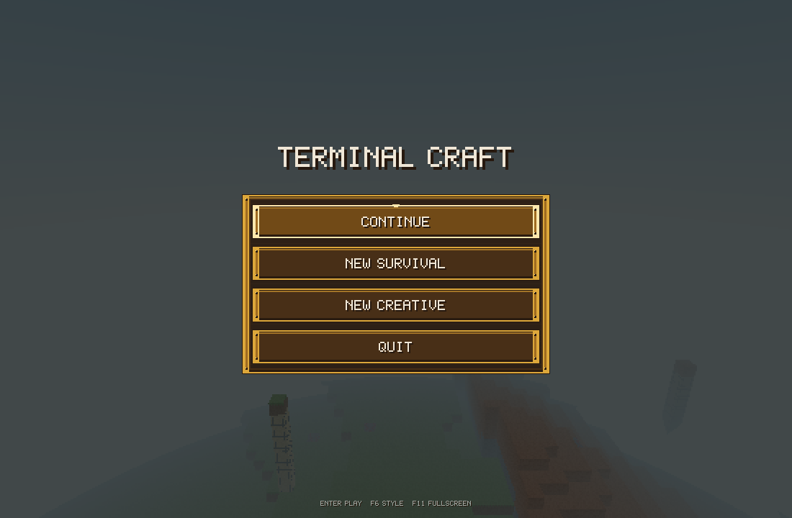
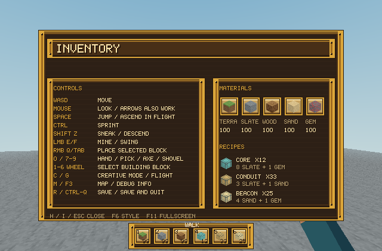
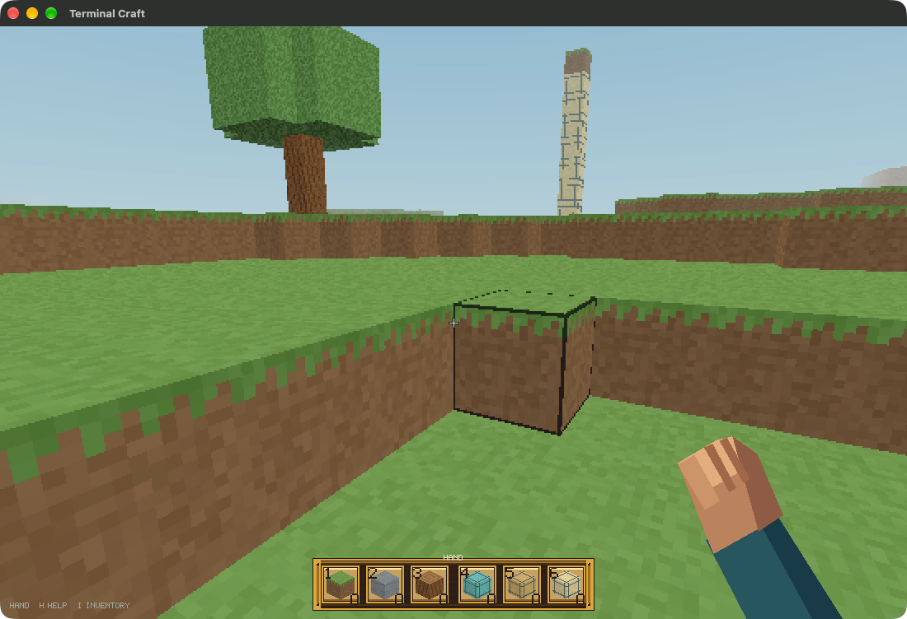

# Gilded UI — 0.9.1

Gilded is the default built-in visual mode for Terminal Craft. It uses original
procedural gold-and-bronze pixel geometry inspired by ornate sandbox-game UI:
beveled plates, riveted borders, cream slots and shadowed lettering. No image,
logo, font file or texture was extracted from the supplied reference pack.

## Use it

```sh
terminal-craft                      # Gilded by default
TERMINAL_CRAFT_UI=classic terminal-craft  # opt into Classic
# Same installed app, without relying on a shell PATH:
'/Applications/Terminal Craft.app/Contents/MacOS/launch' --gilded

# Style selection also works with terminal adapters:
TERMINAL_CRAFT_UI=gilded terminal-craft --terminal
TERMINAL_CRAFT_UI=gilded terminal-craft --here
```

Press **F6** in a menu or during play to switch Classic/Gilded immediately.
Some keyboards require **Fn-F6**. Gilded is the default; the environment
variable sets the initial style, and `--gilded` explicitly selects the native
Gilded launch. Unknown environment values fail with an error rather than silently
choosing a style. Selection lasts for the process and is not written into a save.

## What changes

- Main and pause menus: gold frames, bronze button faces, disabled/selected states.
- Hotbar: cream-backed slots with the existing block icons and resource counts.
- **H / I**: two-column inventory and field guide, with material counts, controls,
  existing recipes and quantities buildable from current resources.
- Native map: matching ornamental border. Terrain/map data is unchanged.
- Kitty pixel mode shares the pixel UI; ANSI fallback uses warm text/HUD colors.

The inventory guide is informational, not a draggable inventory. There is no new
crafting table, brewing system, grindstone, armor system or external mod loader.
World generation, physics, tools, recipes, resource costs and save formats stay
unchanged. The shared pixel font also gains missing punctuation glyphs.

## Actual captures








The menu/guide images show the current default UI from the real installed SDL
smoke-test session, not a mockup. The last image predates the text trim and is a separate installed-app launch with `--gilded` and a
private QA save path. Later OS window captures failed, so follow-up synthetic
keyboard effects in that extra session are not claimed; it was terminated after
capture. Scripted native QA below independently verifies style switching and
save/quit behavior.

## Current default and text-cleanup verification

Final local run: **2026-09-05 06:59 UTC**.

- **44 Rust tests and 10 Python integration tests passed.**
- Six real SDL sessions: release and installed binaries, each with no style
  setting, explicit Classic, and explicit Gilded. Unconfigured launches select
  Gilded; all sessions pass live F6 switching and the existing motion/save gates.
- Normal and deliberately descheduled terminal tests passed in both styles.
- Formatting, Clippy, release build, app signature and matching installed/release
  hashes passed. Default menu and compact inventory captures were refreshed.
- Text cleanup removes mode/engine slogans, random terminal splash lines,
  redundant HUD hints and verbose headings, preserving controls and counts.

Evidence: [verification/gilded-default](verification/gilded-default/).

## Initial 0.9.1 verification

The historical evidence below predates the text trim and Gilded default.

Initial local run: **2026-09-05 UTC / 2026-09-04 PDT**.

- **44 Rust tests passed**; the explicit rendering benchmark remains opt-in.
- **10 Python integration tests passed**, including legacy/enhanced PTY gameplay
  in Classic and Gilded, invalid-style handling and installed-app tests.
- Four real SDL sessions: release and installed binaries, each in both styles.
  All report movement, stop, jump, flight, focus/pause freeze, pointer capture,
  resize/fullscreen, return-to-menu and exact save/reload success.
- Each native session asserts **F6 round-trip switching**, and captures the field
  guide at the **640×420** minimum window size as well as the normal size.
- Deliberately descheduled PTY regression passed in both styles and protocols.
- Formatting, Clippy with warnings denied, release build and app signature passed.
  Installed/release executable hashes match.
- New UI unit tests cover theme validation, clipped frame drawing, distinguishable
  button states, punctuation, and field-guide drawing at four window sizes.

Portable evidence: [verification/gilded](verification/gilded/). These are local
macOS results; the repository's hosted CI tests builds and CLI/PTY behavior on
macOS and Ubuntu, not interactive SDL or the installed macOS app. Actual desktop
refresh rate and subjective control feel are not inferred from these tests.
