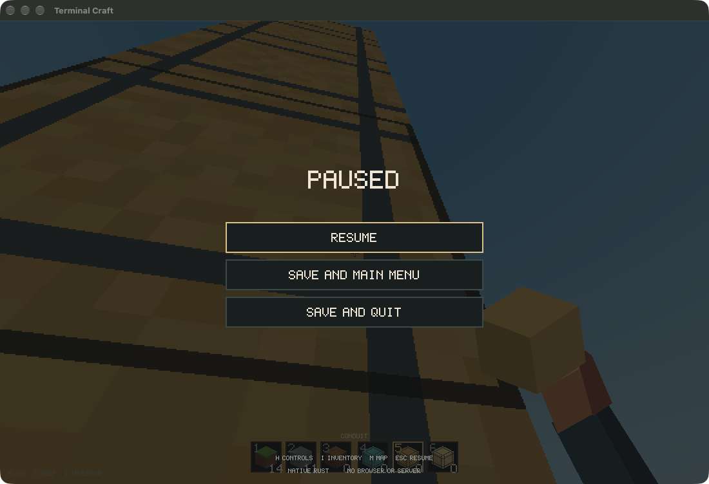
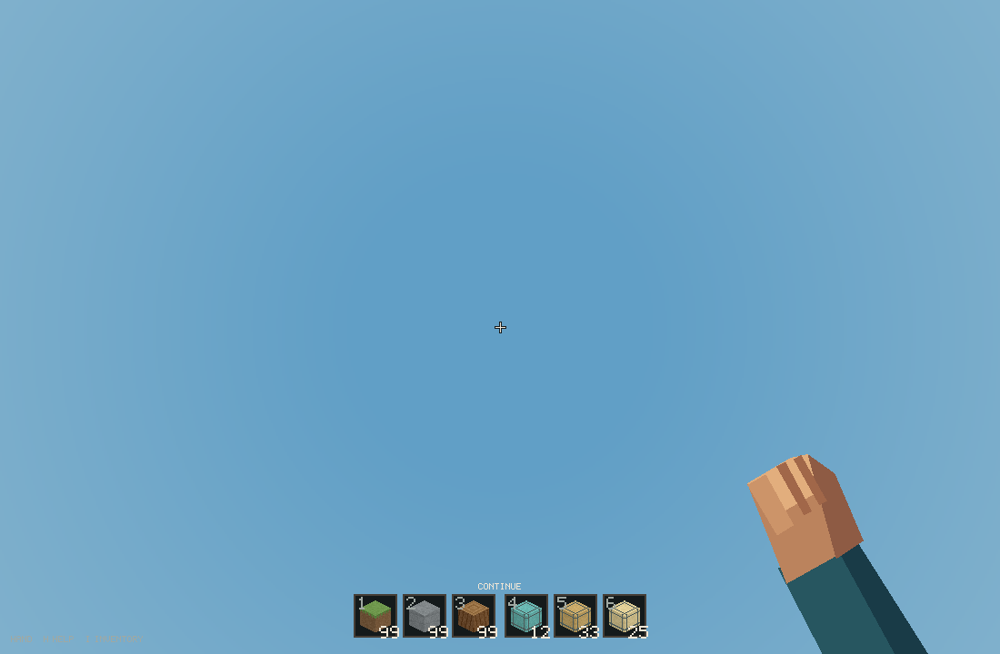
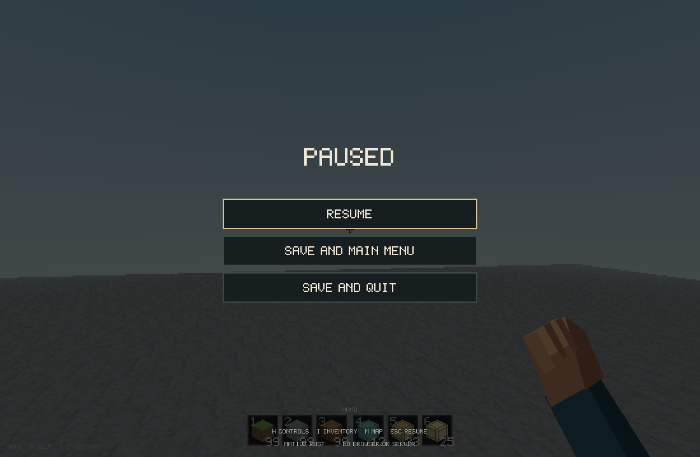
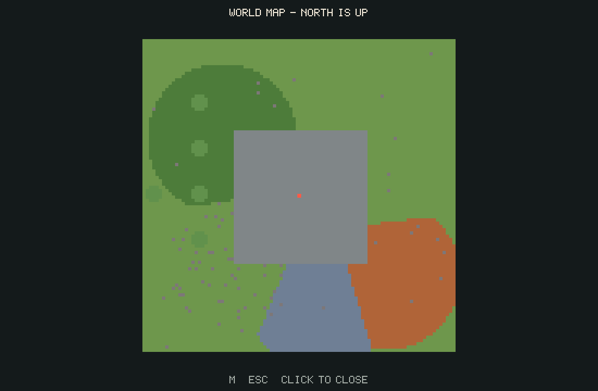
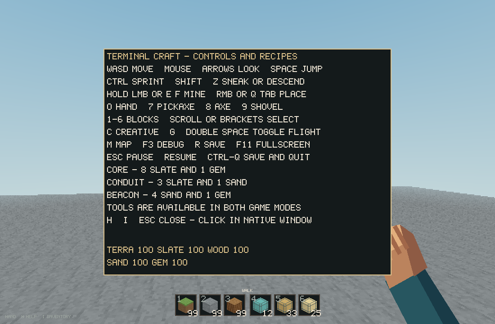

# Terminal Craft 0.9.0 — native motion

The default application now hosts the existing Rust game in a native SDL window.
This is the user-selected alternative to terminal edge-turning: true relative
mouse input and pointer lock. Literal terminal mode remains optional; both hosts
share the engine, renderer and saves. Block Craft remains the browser product.

## Verified results

The source release and installed executable each completed a **142-frame native
session** through SDL's event queue, shared simulation and actual presentation.
The checks cover simultaneous W/D movement; immediate stopping; rotation beyond
one revolution; near-vertical aiming; jump; flight ascent/descent; frozen
position/view on pause and focus loss; pointer release on pause/exit; mouse and
keyboard menu navigation; main-menu return/continue; actual window resize and
fullscreen transitions; and exact saved-pose reload.

The final suite passed **40 Rust tests and 6 Python integration tests**, including
legacy and enhanced press/release PTY sessions and both native executables.
Format, strict Clippy, app signature and installed/source binary-hash checks
passed. Actual results and command-log paths are retained in
[the motion evidence](benchmarks/native-motion.json).

The separate ignored CPU renderer benchmark is not counted as a regular test.
The native frame-duration metric includes rendering/upload/present calls but
excludes intentional frame-budget sleep; it is **not physical display FPS**.

## Input and QA boundaries

A live Kitty/crossterm probe confirmed press/release packets for W/A, Shift-W,
Space and arrows. `examples/input_probe.rs` keeps this reproducible in an explicit
local test terminal. The old CSI-u compatibility comment was obsolete. Enhanced
keys remain down until release; delayed repeat events cannot restart released keys.

The native smoke test uses a deliberately flat disposable world, fixed 1/60 s
simulation steps and tagged synthetic SDL input. It uses the production host,
game and renderer, not a mock game. Live mouse/scroll events were observed
interleaving with early scripted sessions; QA now excludes physical input except
Escape to abort. Real OS window/focus events remain active. The event trace and
poses are retained with the report. Automated correctness tests do not establish
subjective comfort; sensitivity and feel still benefit from normal player feedback.

Sneaking slows movement and lowers the viewpoint; crawling/reduced collision
hulls, gamepads, VR, mobs, health/combat and multiplayer are not claimed complete.

## Save handling

The native integration tests assert normal and legacy save hashes are unchanged
across their automated runs. After those tests finished and the native app was
opened, the live primary save changed. That later progress was left alone; no
rollback or reset was performed. The legacy save still matches its earlier hash.
All automated gameplay uses separate QA worlds.

## Screenshots

Live installed app, opened through LaunchServices and captured on its pause screen:



Actual scripted QA frames from the disposable flat world:






The controls image was also OCR-checked against the current bindings. A bounded
accessibility walk was required for the native app capture; its screenshot was
matched to the exact PID and WindowServer window ID.

## Reproduce

```sh
python3 scripts/install_macos.py
python3 scripts/verify.py
# Choose an output directory that does not exist.
TERMINAL_CRAFT_SENS=0.0024 target/release/terminal-craft --native-smoke-test /tmp/terminal-craft-new-qa
```

GUI tests briefly capture the pointer and toggle fullscreen. Escape aborts.
Reports, events, poses and images are retained in `target/verification/native-*`.
SDL is statically linked: `otool -L` showed only system libraries/frameworks.
The installed native app needs neither the repository, Homebrew SDL nor Kitty.
It is locally ad-hoc signed, not notarized or published. Previous app bundles are
backed up by the installer and existing Git history/releases remain intact.
