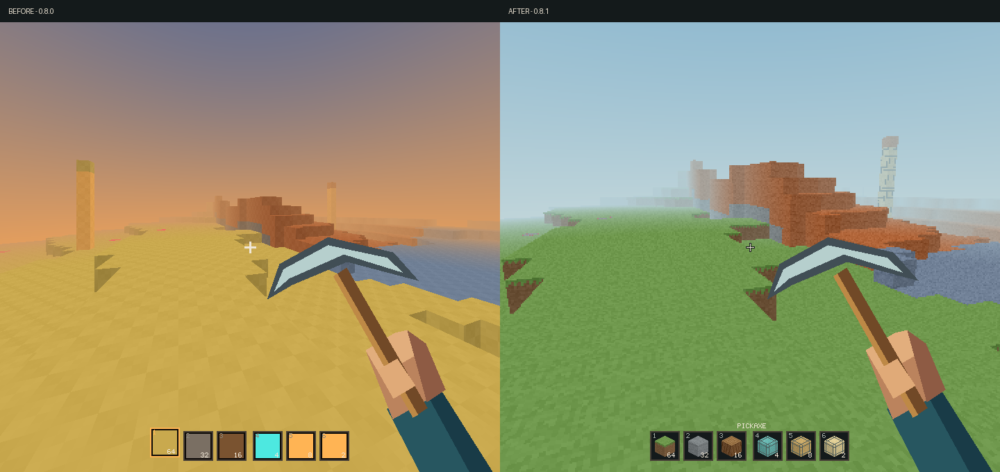
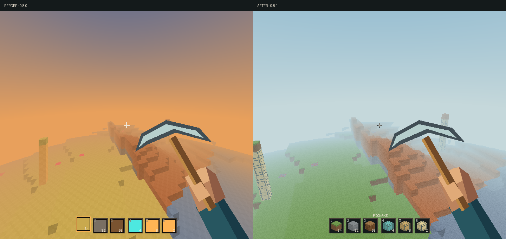

# Terminal Craft 0.8.1 — feel and performance pass

## What changed

- Orthogonal camera basis: rendered aim and mining direction agree at steep pitch; 70-degree vertical FOV.
- Daylight haze and a restrained natural palette; original 16x16 grass/earth, bark, stone and ore textures.
- Native-resolution textured cube icons, a smaller outlined crosshair, and a correct held-item label.
- Target-block outline and progressive cracks, rather than only a floating progress bar.
- Tool equip dip, swing wind-up/recovery, eased walking bob; no walking bob while pushing into a wall.
- 60 FPS frame-budget target in play, reduced refresh while map/help is open. This is a target, not a claim of locked 60 FPS.
- Bounded world raster plus full-resolution hand/HUD. Native-resolution world option remains available.

## Measured CPU rendering

Apple M4 / arm64. Same world seed and camera poses; 30 measured frames per case after 3 warm-up frames.
Median and p95 timings are milliseconds. The scope includes world, hand, and HUD rendering, **not terminal transport, the compositor, or physical display latency**.
FOV, camera math, textures, and resolution policy changed, so these are full-preset before/after results, not a lossless or isolated-algorithm speedup.
The machine was an active desktop; these short runs are not a controlled cross-machine benchmark.

| Scene | Window raster | Before median | After median | Before p95 | After p95 |
|---|---|---:|---:|---:|---:|
| downward | 720×648 | 9.84 | 2.07 | 11.36 | 2.37 |
| ground | 720×648 | 9.89 | 2.98 | 11.45 | 3.54 |
| vista | 720×648 | 13.06 | 3.65 | 16.96 | 4.18 |
| downward | 1280×720 | 21.04 | 4.40 | 26.34 | 4.96 |
| ground | 1280×720 | 18.81 | 5.67 | 21.86 | 6.58 |
| vista | 1280×720 | 24.42 | 7.17 | 27.69 | 7.68 |
| downward | 1920×1080 | 41.91 | 9.44 | 54.85 | 10.13 |
| ground | 1920×1080 | 44.44 | 12.42 | 51.20 | 14.11 |
| vista | 1920×1080 | 50.55 | 14.96 | 54.75 | 16.08 |

The measured 1080p ground case included one 28.76 ms CPU outlier; the median/p95 values do not imply zero stutter. Raw maxima remain in the JSON.

## Reproduce

```sh
TERMINAL_CRAFT_BENCH_OUT=target/benchmarks/recheck cargo test --release --locked render_benchmark -- --ignored --nocapture
```

This writes actual render timings, PPM frames and a QA world in the specified output directory. Use a disposable directory.
For native world resolution:

```sh
TERMINAL_CRAFT_QUALITY=native terminal-craft
```

Balanced mode caps world raster dimensions at 960×540 using integer downsampling and nearest-neighbor expansion. It does **not** reduce hand or HUD resolution.

## Visual evidence

The comparison images are actual deterministic renderer outputs, side by side, not design mockups.
The camera correction/FOV change intentionally changes framing.





The following is a real installed-app window capture during interactive QA, not the deterministic benchmark scene state.


## Verification

30 Rust tests and 4 Python integration/installer tests passed. The ignored hardware benchmark was run separately and passed.
Formatting and Clippy with warnings treated as errors passed. Installed executable SHA-256 matches the tested release.
The actual release executable passed the PTY mining/placement/help/movement/save sequence.
No save format change or save reset was introduced. Block Craft was not modified in this pass.

**Boundary:** legacy terminal key-hold fallback and terminal mouse constraints remain; this pass does not claim raw-input parity with a conventional 3D engine.
