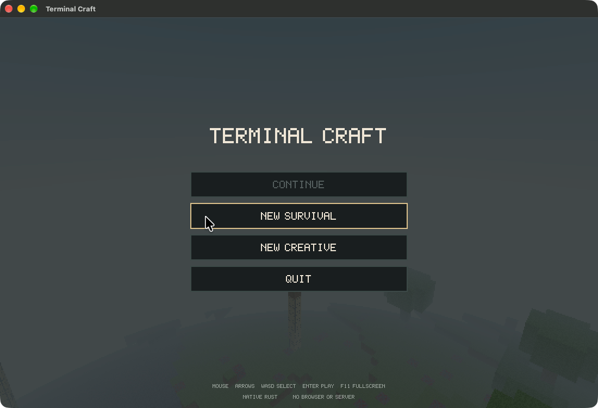
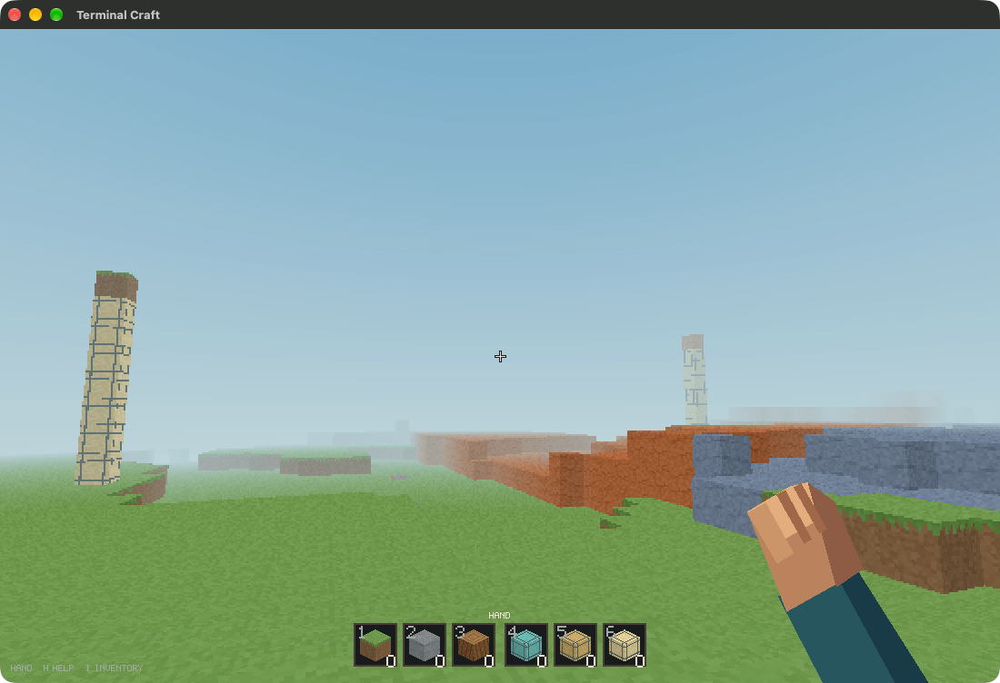

# Final pre-publication verification — v0.9.0

Run: **2026-09-05 UTC** (2026-09-04 PDT), before the initial public push.
Tested source commit: `23296a81119c82a55fb1b81f679e9d8e461779cb`.
The publication commit adds documentation and evidence only; no gameplay source changes.

Environment: macOS 27.0, arm64; Rust/Cargo 1.98.0.

## Results

| Gate | Actual result |
|---|---|
| `python3 scripts/install_macos.py` | PASS; release rebuilt, app installed, old app backed up |
| `cargo fmt --check` | PASS |
| `cargo clippy --all-targets --locked -- -D warnings` | PASS |
| `cargo test --locked` | 40 passed, 0 failed, 1 intentionally ignored hardware benchmark |
| `cargo build --release --locked` | PASS |
| `python3 -m unittest discover -s tests -v` | 6 passed |
| `git diff --check` | PASS |
| Release versus packaged binary SHA-256 | Exact match |
| `codesign --verify --strict` | PASS for locally ad-hoc-signed app; not notarization |
| `otool -L target/release/terminal-craft` | System libraries/frameworks only; no Homebrew SDL dependency |
| Gitleaks full existing history (`--all`) | 4 commits scanned, no leaks detected |
| Gitleaks working directory | No leaks detected |

Raw [verification report](verification/public-launch/report.json),
[Rust test log](verification/public-launch/3.log), and
[Python integration log](verification/public-launch/5.log) are committed alongside
this report. Local root paths in the portable logs are replaced with `<repository>`
or `~`; test output is otherwise retained.

## Functional coverage

Both the release executable and the installed app binary completed a real SDL-window
scripted session (142 frames each). Both reported passing resize/fullscreen round trips,
walking and immediate stopping, pause/focus freezing, mouse turning, near-vertical pitch,
jumping, flight ascent/descent, pointer locking/release, return to main menu, and exact
save/reload. The integration test checked normal native/legacy saves remained unchanged.

- [Release native-window report](verification/public-launch/native-0.json)
- [Packaged native-window report](verification/public-launch/native-1.json)

The two terminal PTY tests cover legacy and enhanced keyboard protocols, tool selection,
mining, placement/resource cost, help, movement, save and exit. Other Python checks
exercise app/CLI help without custom shell configuration and safe atomic binary copying.

## Normal launcher and visual inspection

The packaged `Contents/MacOS/launch` was also invoked **without arguments**, with
`TERMINAL_CRAFT_SAVE` pointing to a disposable QA world. Its native main menu was
visually checked; a menu click entered an actual rendered world. The window later
paused on focus loss. **Save and quit** closed that exact QA process, and
`--check-save` validated the resulting disposable survival world with player state.
Background tool-selection keystrokes while paused were not counted as gameplay evidence.

Tracked game screenshots were visually reviewed for accidental personal desktop content.
No such content was visible. Existing Git provenance and commit-author metadata are retained;
this is not a rewritten or anonymized history. Secret-scanner results are not a guarantee
that every possible sensitive value can be detected.

## Limits

This is functional automation plus a scoped GUI check, not subjective play-feel approval.
No new hardware benchmark was run; the deliberately ignored benchmark is not a test failure.
Native-loop/CPU timings are not physical display FPS. This local pass does not establish
Windows or Linux runtime support. GitHub Actions results, once available, are separate
from the local run recorded here. Social drafts are not published or scheduled.
