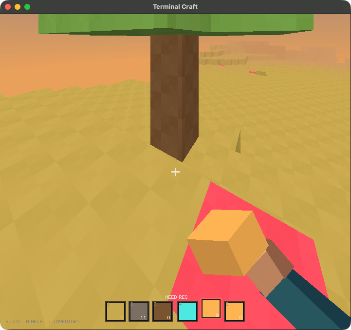

# Local release verification

Executed at `2026-09-05T00:41:36.536005+00:00` on macOS `arm64`.

These are results from local execution, not claims that remote CI has run.

| Check | Result |
|---|---|
| `cargo fmt --check` | passed |
| `cargo clippy --all-targets --locked -- -D warnings` | passed |
| `cargo test --locked` | 23 tests passed |
| `cargo build --release --locked` | passed |
| `/Applications/Xcode-beta.app/Contents/Developer/usr/bin/python3 -m unittest discover -s tests -v` | 4 tests passed |
| `git diff --check` | passed |

The PTY integration launches the release executable against a disposable fixture and
checks mining, placement/inventory cost, tool selection, help, grounded walking,
v2 saving, and exit. Save migration tests preserve the original file.

Installed app and built release binary SHA-256:
`5fcddc6f503ce146776d290ce599e95a0c282465319def5a8588ba6623fcad15`

Both installed app bundles passed local ad-hoc signature validation. The native app
was opened through LaunchServices and its live terminal window was captured.
Block Craft separately passed its production build and four launcher regression tests.

The native screenshot below is from the final installed app.

Raw command logs are regenerated by `python3 scripts/verify.py` under
`target/verification/`. These build outputs are intentionally not tracked.

No remote repository was created or pushed by this release.
